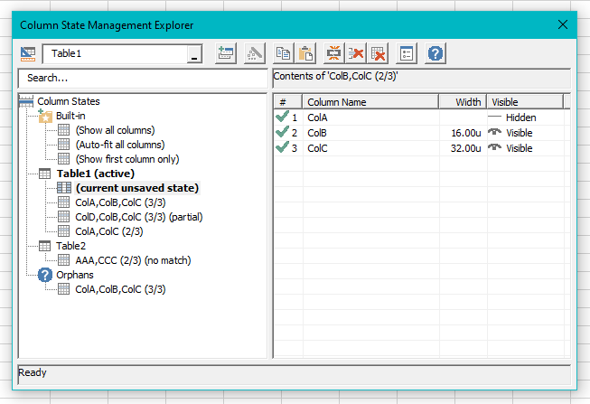

# excel-column-manager
Save and restore the state of Columns in Tables in Excel.

When working with large tables in Excel that span across many columns, it's annoying having to constantly hide and unhide columns to be able to navigate a spreadsheet in a sane manner. This tool lets you save presets of which columns you have open and their widths, reducing the time wasted on repeatedly setting them *just* right.

Need to unhide all the columns briefly to do something? No worries - save your state, use the "Show all columns" state, do what you need to do, then restore the initial state. Someone used autofit and all your columns are so far off the screen you can't see the mouse cursor to resize them? Just use the "Standard width" state.

It might only save a few minutes of time in your workday, but computers were invented to be used by humans - not the other way around. I hope this tool helps you spend less time jumping through hoops to get Excel to give you your data the way you want it.

## 📸 Screenshots

## ⭐ Features
- ✅ Save and restore the state of a Table's Columns.
  - Supports: Width, Hidden, Outline Level, and Freeze Pane
- ✅ Partially restore a state to any table if at least one column is present.
- ✅ Hide any columns that *don't* match a saved state - works great when your table keeps growing excess columns.
- ✅ Shortcuts for common tasks, including "Show all (standard)", "Show all (autofit)", and "Show first only".
- ✅ Import and Export column States manually (using Base64 encoded strings).

## 📝 Notes
- 🚧 [TODO List](Notes/TODO.md)
- ☕ [Dev Notes](Notes/DevNotes.md)

# 🙏 Thanks
- Developed using [Rubberduck VBA](https://github.com/rubberduck-vba/Rubberduck) and greatly inspired by [Mathieu Guindon](https://github.com/retailcoder/)'s blog posts.